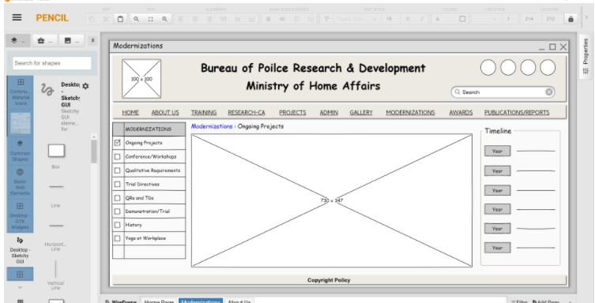
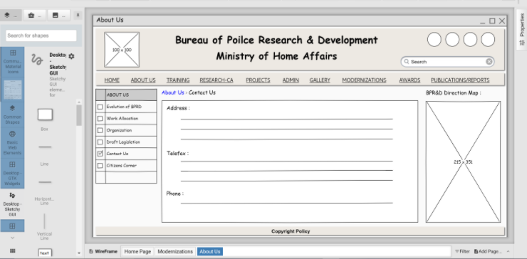

# Wire frame for a website

## AIM:
To design a wire frame for a website.

## DESIGN STEPS:
```
Step 1:
Open a New Document and resize the canvas to your desired size.

Step 2:
Use the tools to design a Wire frame for the given website.

Step 3:
Duplicate the layout and modify the further pages.

Step 4:
Save the pages once you're done.
```
## OUTPUT:






## Result:
Thus a wire frame is designed for a given website.
